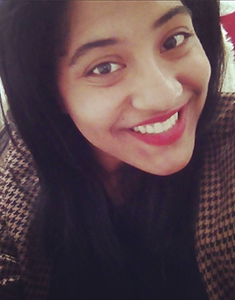

# EbbandFlow

                            A Dao of Web Design Summary
                       
           
                     

Best practices

Naming (conventions) Things

-Use lowercase for files,folders and in markup -Use a hyphen (-) or an underscore(_) and not a space (%20) when separating phrases in naming files, folders, and in markup.

Project (Folder, Repo) Structure

For Example

project-name -README.md -index.md -index.html -img/`

**summary** 

The article, A Dao of Web Design discusses the tension between the old ways of printed media vs. the web. Web is a new media and one that is constantly changing. Those that are used to printed media such as letters, books and newspapers often find the web daunting and refuse to submit to change. We should not stay stuck in the past but instead evolve with the changing of the time, much like the teachings of Daoism philosophy. A Dao of Web Design includes quotes from the Tao Te Ching. It is a book of Chinese philosophy which emphasize the importance of flexibility, harmony and change. Theses quotes are used to relate back to web design to show just how relevant they are to the web and in modern day society.
The article uses examples of different fonts, layouts and colors, explaining the importance of accessibility for all media consumers. You should take into account that the reader might be far or near sighted and ensure that your web based media is accessible and user friendly to all. 
Being able to adapt is essential in this field. As the world is constantly changing, so must you. Change is difficult for some and we should not forget the hundreds of years of work that came before us. We must honor the past, but understand that the web is new and it is a media that is constantly evolving. It is our job to embrace it and explore that endless possibilities that the web 

**Revision**
 
Web is a new media and one that is constantly changing. Those that are used to printed media such as letters, 
books and newspapers often find the web daunting and refuse to submit to change. There is a rising tension between the old ways of printed media vs. the web. We should not stay stuck in the past but instead evolve with the changing of the time, much like the teachings of Daoism philosophy.

_A Dao of Web Design_ includes quotes from the Tao Te Ching. A book of Chinese philosophy that emphasize the
importance of 

* flexibility
* harmony 
* change 

Theses quotes are used to relate back to web design and show just how 
relevant they are in modern day society.

You should take into account that the reader might be far or near sighted and ensure 
that your media is accessible and user friendly to all. 

Being able to adapt is essential in this field.

As the world is constantly changing, so must you. 
Change is difficult for some and we should not forget the hundreds of years of work that came before us. 
We must honor the past, but understand that the web is new and it is a media that is constantly evolving. 
It is our job to embrace it and explore that endless possibilities that the web has to offer.

**About The Author**

  Jade Butler is an animation major from massachusetts. She enjoys watching cheesy netflix movies and drinking copious amounts of tea. When she isn't drawing, she spends her time reading everything from y.a fiction to Tolstoy and listening to musical theatre soundtracks.

 

**read full article** (https://alistapart.com/article/dao)
